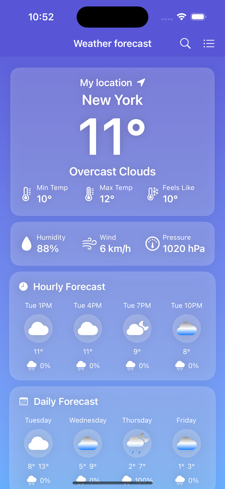
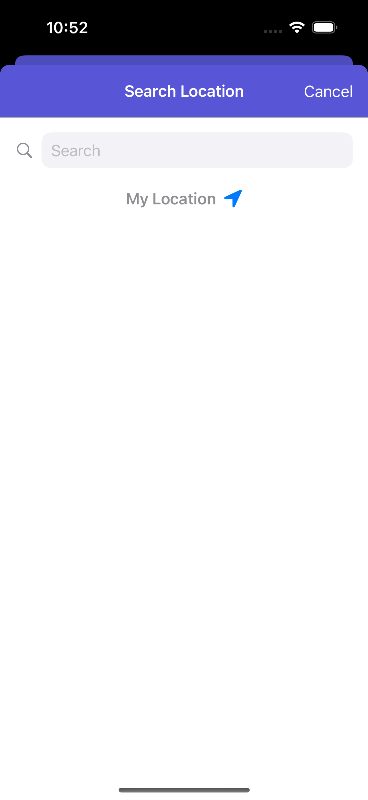
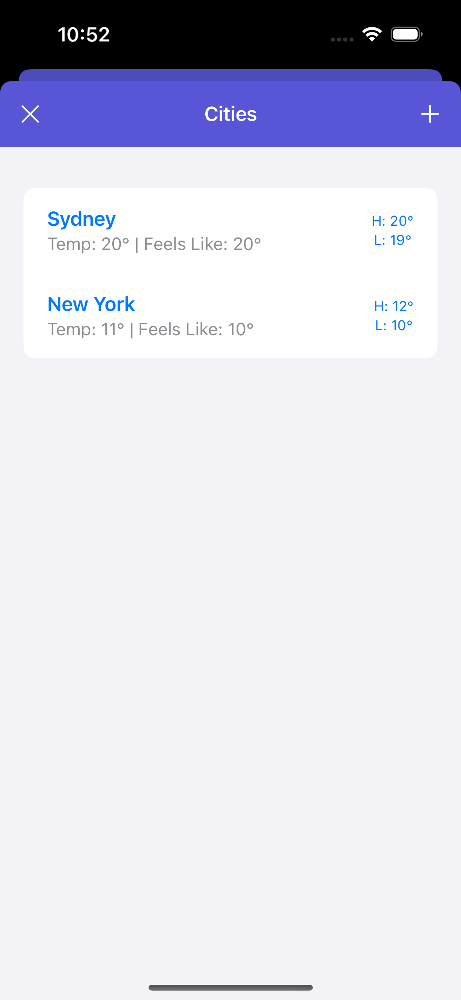
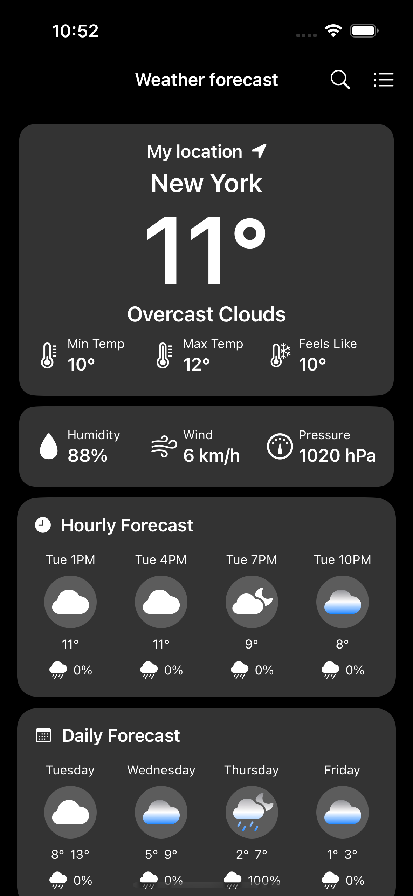
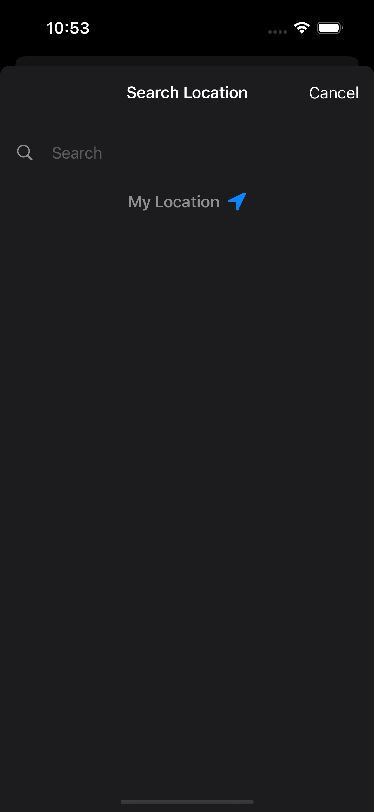
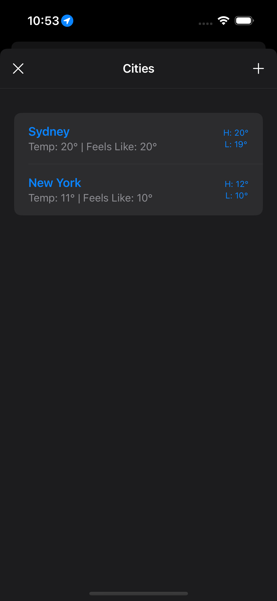

# 🌤️ WeatherApp

WeatherApp is a weather forecast application built using **SwiftUI**, **Combine**, and REST APIs. It provides users with detailed weather information for their current location and saved cities, offering both **light** and **dark modes** for better user experience.

## 🚀 Features

- **Current Location Forecast**  
  The app fetches weather data for your current location using Core Location and reverse geocoding.

- **Search for Cities**  
  Easily search and add cities using the search bar integrated with Apple's **MapKit** for accurate location data.

- **Saved Cities List**  
  Save multiple cities and view their real-time weather data, including:
  - Temperature
  - Feels Like
  - High and Low Temperatures

- **Hourly and Daily Forecast**  
  View hourly forecasts and a 5-day weather outlook with percentage rain probability.

- **Light and Dark Mode**  
  Adaptive UI to match system settings for light and dark themes.

- **iCloud Sync**  
  All saved cities are synchronized via **iCloud** to ensure data persistence across devices.

## 🛠️ Technologies Used

- **SwiftUI**: For building declarative and dynamic UI components.
- **Combine**: To manage asynchronous data flow and bind the UI to the weather data.
- **REST APIs**: Integrated with OpenWeatherMap (or similar API) to fetch weather forecasts.
- **Core Location**: To fetch the user's current location.
- **MapKit**: For city search and geolocation.
- **iCloud**: Used for saving and syncing the list of cities across multiple devices.

---

## 📸 Screenshots

### **Light Mode**

| Main Weather View  | Search Location | City List |
|:------------------:|:---------------:|:---------:|
|  |  |  |

### **Dark Mode**

| Main Weather View  | Search Location | City List |
|:------------------:|:---------------:|:---------:|
|  |  |  |

---

## 📦 Setup and Installation

1. Clone the repository:
   ```bash
   git clone https://github.com/<YourUsername>/WeatherApp.git
   cd WeatherApp
   ```

2. Install required dependencies using **Swift Package Manager**.

3. Configure your API key:
   - Sign up on [OpenWeatherMap](https://openweathermap.org/api).
   - Replace `YOUR_API_KEY` in `WeatherService.swift` with your API key.

4. Run the project in **Xcode**:
   - Minimum iOS version: 15.0  
   - Swift version: 5.0

---

## 🔑 API Integration

The app fetches weather data from a REST API (OpenWeatherMap). Ensure the following endpoints are configured:

1. **Current Weather**:  
   ```
   https://api.openweathermap.org/data/2.5/weather?q={city}&appid=YOUR_API_KEY
   ```

2. **Forecast**:  
   ```
   https://api.openweathermap.org/data/2.5/forecast?q={city}&appid=YOUR_API_KEY
   ```

---

## 🎯 Future Enhancements

- Implement widgets to display weather data on the home screen.
- Add offline support with local caching.
- Integrate weather alerts for severe conditions.

---

## 📄 License

This project is licensed under the MIT License. See [LICENSE](LICENSE) for details.

---

## 🙌 Acknowledgments

- [SwiftUI Documentation](https://developer.apple.com/documentation/swiftui)
- [Combine Framework](https://developer.apple.com/documentation/combine)
- [OpenWeatherMap API](https://openweathermap.org/api)

---

##  Contribution & Support

If you’d like to contribute to this project or show your support, you can buy me a coffee! ☕

PayPal Email: fabricio_0505_@hotmail.com